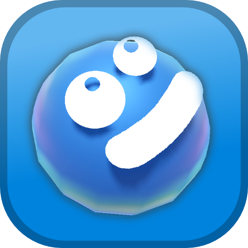

[🎮 Play Now (Android APK)](http://bubble-odysea.kelteseth.com/GGJ2025%20Bubble.apk) 

# 🌊 Bubble Odyssey

### 🎮 Guide a tiny bubble through the depths of our dying oceans

Journey through an atmospheric underwater world where every tilt of your phone guides your fragile bubble through increasingly challenging labyrinths. As you ascend from the mysterious deep sea, discover the haunting truth of our world's future. 

🌟 **Key Features:**
- 📱 Intuitive tilt controls
- 🎯 Progressive difficulty scaling
- 💫 Dynamic bubble physics
- 🌊 Immersive underwater environments
- 🌍 Compelling environmental narrative with a dark twist xD

## 🛠️ Setup & Requirements

- **Engine**: Requires [Godot 4.4 beta1](https://godotengine.org/article/dev-snapshot-godot-4-4-beta-1/) or higher (due to new UUID system)
- **Development Setup**:
  1. Clone the repository
  2. Open project in Godot 4.4+

For mobile deployment, follow the official Godot documentation:
- [Android Export Guide](https://docs.godotengine.org/en/stable/tutorials/export/exporting_for_android.html)
- [iOS Export Guide](https://docs.godotengine.org/en/stable/tutorials/export/exporting_for_ios.html)

📝 Follow our development journey at [www.zoewelli.de](http://www.zoewelli.de)

